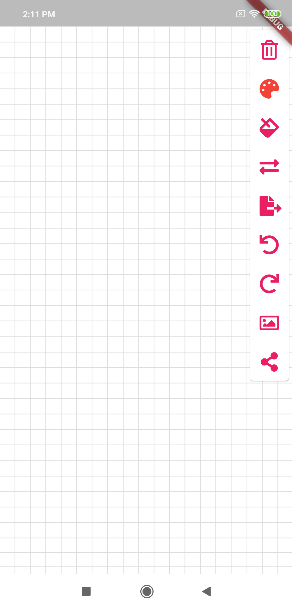

# flutter_paint

Simple paint app implement in Flutter

App create command line:
flutter create -i swift -a kotlin --androidx --project-name flutter_paint --org io.github.jenthone -t app flutter_paint

